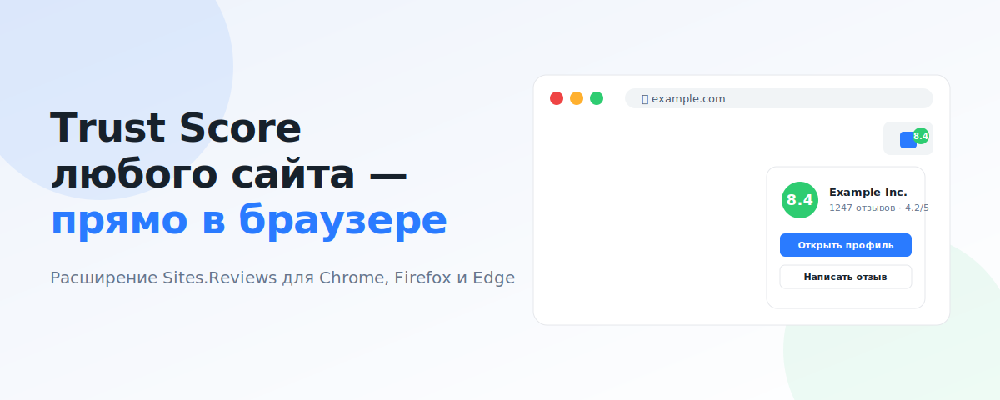
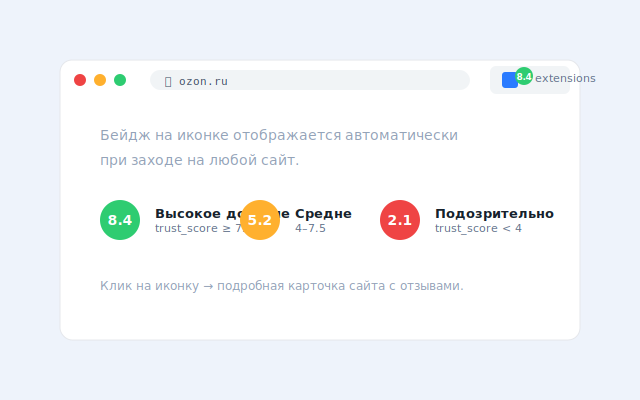
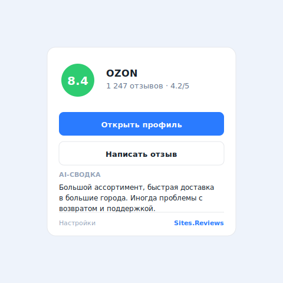
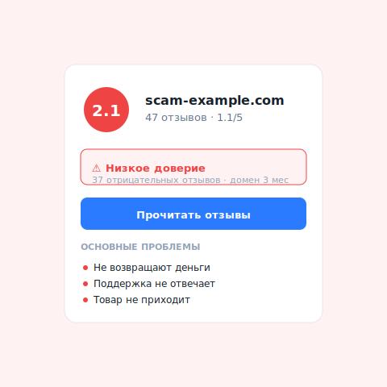

<div align="center">


# Sites.Reviews — Trust Score Extension

**Узнайте репутацию любого сайта прямо в браузере.**
Бейдж с Trust Score, отзывы, проверка безопасности — для каждого домена, на который вы заходите.

[](https://developer.chrome.com/docs/extensions/develop/migrate/what-is-mv3)
[](https://chrome.google.com/webstore/)
[](https://addons.mozilla.org/)
[](https://microsoftedge.microsoft.com/addons/)
[](LICENSE)
[](docs/PRIVACY.md)

[Установить](#установка) · [Возможности](#возможности) · [API](https://sites.reviews/api) · [Сайт](https://sites.reviews) · [Экосистема](https://github.com/SitesReviewsTrust/sites-reviews-docs)

</div>

---

<p align="center">
  
</p>

## ⭐ Возможности

- **Trust Score 0–10** — мгновенная оценка надёжности сайта
- **Цветной бейдж** на иконке расширения: зелёный (≥7.5), жёлтый (4–7.5), красный (<4)
- **Popup с деталями** — количество отзывов, средний рейтинг, ссылки на профиль и форму отзыва
- **8 000+ проверенных бизнесов** — российских и международных
- **Нет в каталоге?** — кнопка добавить сайт и оставить первый отзыв
- **Manifest V3** — современный стандарт, лучшая производительность
- **Приватность** — отправляется только домен текущей вкладки, без ключей, cookie, контента и трекинга

> Планируется: AI-сводки плюсов/минусов и блок проверки безопасности домена прямо в popup.

## 📸 Скриншоты

<table>
<tr>
<td><br><sub>Бейдж на иконке расширения</sub></td>
<td><br><sub>Popup — надёжный сайт</sub></td>
</tr>
<tr>
<td colspan="2" align="center"><br><sub>Popup — подозрительный сайт</sub></td>
</tr>
</table>

## 🚀 Установка

### Chrome Web Store / Firefox Add-ons / Edge Add-ons
*В процессе модерации — обновим эту секцию когда расширение появится в магазинах.*

### Вручную (developer mode)

#### Chrome / Edge / Brave / Opera
1. Скачайте архив: **[Latest Release](../../releases/latest)**
2. Распакуйте в удобную папку
3. Откройте `chrome://extensions` (или `edge://extensions`)
4. Включите **«Режим разработчика»** в правом верхнем углу
5. Нажмите **«Загрузить распакованное»** и выберите папку — готово, ключи и настройка не нужны

#### Firefox
1. Скачайте архив, распакуйте
2. Откройте `about:debugging` → **«Этот Firefox»**
3. **«Загрузить временное дополнение»** → выберите `manifest.json`

Расширение работает сразу: оно обращается к **публичному API** Sites.Reviews без регистрации и ключей.

## 🏗 Архитектура

```
┌──────────────────────────────┐
│   Active tab                  │  ← пользователь открывает любой сайт
│   URL → hostname              │
└──────────────┬───────────────┘
               │
        background.js (MV3 service worker)
               │
               │  GET /api/public/v1/check?domain=hostname
               ▼
┌──────────────────────────────┐
│  sites.reviews/api/public/v1 │  ← публичный API, rate-limit per IP
│   trust_score, avg_ratings,  │
│   total_reviews, is_verified │
└──────────────┬───────────────┘
               │
               ▼
        ┌─────────┐    ┌─────────┐
        │  badge  │    │  popup  │
        │  (8.4)  │    │ details │
        └─────────┘    └─────────┘
```

Подробности — [`docs/ARCHITECTURE.md`](docs/ARCHITECTURE.md).

## 🔐 Приватность

- ✅ Отправляется только **hostname** активной вкладки
- ✅ Ничего не хранится на устройстве (нет ключей, только in-memory кэш на 15 минут)
- ❌ Никакого трекинга, аналитики, истории
- ❌ Никаких cookies, контента страницы, full URL

Полная политика: [`docs/PRIVACY.md`](docs/PRIVACY.md).

## 🛠 Разработка

```bash
git clone https://github.com/SitesReviewsTrust/sites-reviews-extension.git
cd sites-reviews-extension

# Никаких build steps — Manifest V3 работает с raw ES modules
# Просто загрузите как unpacked extension в Chrome
```

Подробности — [`docs/DEVELOPMENT.md`](docs/DEVELOPMENT.md).

## 📚 Связанные проекты

- 🌐 **[Sites.Reviews](https://sites.reviews)** — каталог проверенных бизнесов с реальными отзывами
- 📦 **[Public API](https://sites.reviews/api)** — REST API для встраивания в свои проекты
- 🎨 **[Embed Widget](https://sites.reviews/embed-widget)** — виджет Trust Score для вашего сайта
- 🆔 **[Libermall ID](https://id.libermall.com)** — единый SSO для экосистемы Libermall

## 📄 Лицензия

[MIT](LICENSE) © 2026 Sites.Reviews

---

<sub>Сделано с ❤️ командой [Sites.Reviews](https://sites.reviews) — частью экосистемы [Libermall](https://libermall.com).</sub>
